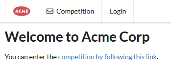
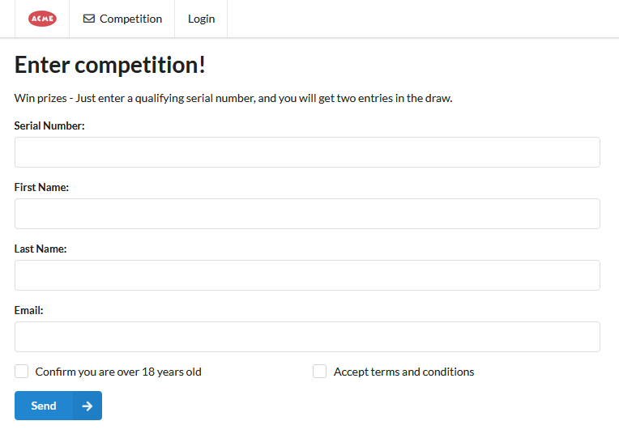
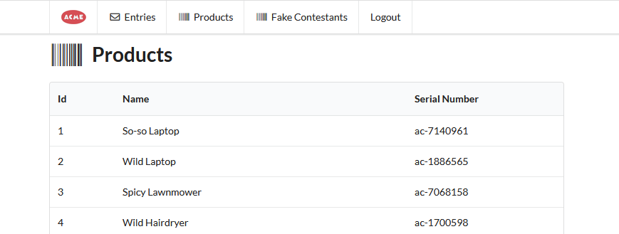
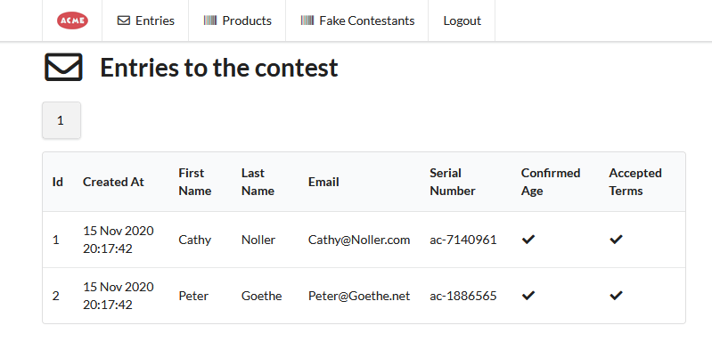
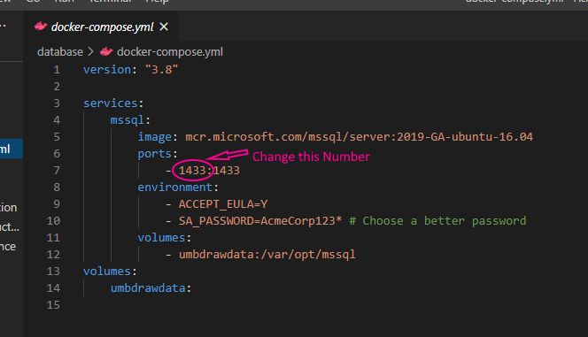
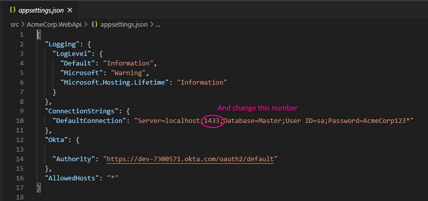

# Acme Corporation Task
The following ports needs to be available locally:
- 1433, 5000, 5001, 8080

The following frameworks are needed to run the project:
- Docker
- npm
- Dotnet sdk or Visual Studio

## Getting ready to run
- Clone this repository.
- in the project root directory run `dotnet restore`.
- goto the `src/acmecorp` folder and run `npm i` to install js dependencies.
- go back to the project root and into `database/`
- run the command: `docker-compose up -d`
  - this might start a download of the needed docker image. 
  - let it download and spin up.
- to apply the database migrations run the command `dotnet ef database update -s ..\src\AcmeCorp.WebAPI\ -p ..\src\AcmeCorp.Persistence`

## Start the projects
### Backend
In one terminal navigate to the `src/AcmeCorp.WebApi` folder and run `dotnet run`
### Frontend
In another terminal navigate to the `src/acmecorp` folder and run `npm run serve`

- [Navigate to localhost:8080](http://localhost:8080)

## External Identity Provider
When clicking on login you will have the oportunity to create a new user. This is done externally on the Otka service.

If you do NOT want to do this, you can use this fake user:
- username: ummic@umacme.com
- pass: umbraCo123

## Entering the competition
You can start submitting entries on the [competition-page](http://localhost:8080/competition) but you will need product Serial Number.
To get a valid one, you need to log in.

## When logged in
Navigate to the [Products-page](http://localhost:8080/products) to se all the serial numbers. Each number can only be used once.

Navigate to the [Entries-page](http://localhost:8080/entries) to se all registered contestants. (If you havent entered any data yet, yours will be empty)

On the [Fake-contestant-page](http://localhost:8080/fakes) I have added the posibility to quickly populate the database with an optional amount, fake and valid contestants.

>This was not part of the "homework", I added it for the sake of convenience.

## Troubleshooting
### HTTPS-certificate
You need to have a valid developer certificate installed, or else the requests between frontend and api will get blocked.
If you are experiencing trouble trying to fetch entries when logged in, or that the products-page seem to keep loading, try the following:
- close your browser
- start a terminal
- run the command `dotnet dev-certs https --trust` 
- click yes, ok or accept if there is a popup
- start your browser again, and head to http://localhost:8080/entries or http://localhost:8080/products

### MS SQL server
If you have trouble starting the database server (docker-compose up) because of a database server already running locally, you can change the db configuration of this program. Here is how:
- go to the `database` directory
- open the `docker-compose.yml` file
- change line 7 to the port number you want to use

- save and try running `docker-compose up -d` again
- shutdown the dotnet project, if it is running
- now go to `src\AcmeCorp.WebApi`
- open the file `appsettings.json`
- change line 10 to reflect the port number you selected for the database server in docker. It is important that you use the same number!

- save file and start up the dotnet project again: `dotnet run`
